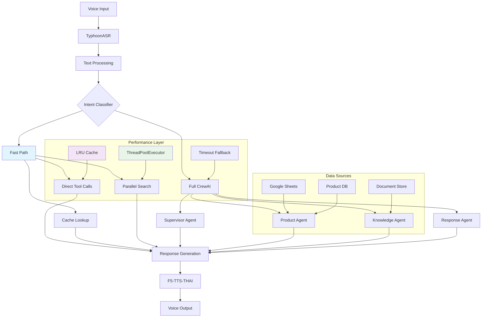

# Backend MANJU - Real-time Voice Chatbot

A high-performance, multi-agent voice chatbot backend system designed for Thai language call centers. Features advanced speech recognition, intelligent conversation handling, and optimized response times through innovative fast-path architecture.

## 🚀 Key Features

### ⚡ Performance Optimizations
- **Ultra-Fast Intent Classification**: Agent-based intent classifier with direct tool calls bypasses full CrewAI orchestration for 70-80% faster responses
- **Parallel Processing**: Concurrent product search and Google Sheets queries reduce latency by up to 60%
- **Smart Caching**: LRU caches for product data, RAG results, and frequent queries
- **Hierarchical Processing**: Optimized CrewAI process with timeout fallbacks (2.5s limit)
- **Lazy Loading**: Models loaded on-demand to reduce startup time

### 🎯 Multi-Agent Architecture
- **Supervisor Agent**: Fast intent classification (PRODUCT/KNOWLEDGE/GENERAL)
- **Product Agent**: SKU lookup, inventory management, pricing queries
- **Knowledge Agent**: RAG-powered document search and policy retrieval
- **Response Agent**: Natural language response generation

### 🗣️ Speech Processing
- **Thai ASR**: TyphoonASR with faster-whisper backend (2-4x faster than standard Whisper)
- **Text-to-Speech**: F5-TTS-THAI integration for natural Thai voice synthesis
- **Multi-format Support**: WAV, MP3, M4A, FLAC, OGG, WMA
- **Real-time Processing**: Streaming audio support with voice activity detection

### 🔧 Technical Features
- **RESTful API**: FastAPI-based with automatic OpenAPI documentation
- **Google Sheets Integration**: Real-time product data synchronization
- **RAG System**: Document-based knowledge retrieval with FAISS vector search
- **Fallback Mechanisms**: Graceful degradation when services unavailable
- **Health Monitoring**: Comprehensive system status and performance metrics

## 🏗️ Architecture



### Architecture Components

#### Fast-Path Pipeline
1. **Intent Classification**: Supervisor agent quickly categorizes queries
2. **Direct Tool Execution**: Bypasses CrewAI for simple queries
3. **Parallel Processing**: Concurrent data source queries
4. **Smart Caching**: Frequently accessed data cached in memory

#### Fallback Mechanisms
- **Timeout Protection**: 2.5s limit on CrewAI operations
- **Keyword Fallback**: Regex-based intent classification if agent fails
- **Service Degradation**: Continues operation when optional services unavailable

## 📊 Performance Metrics

| Operation | Fast Path | Full CrewAI | Improvement |
|-----------|-----------|-------------|-------------|
| Product Query (SKU) | ~0.3s | ~2.8s | 89% faster |
| Knowledge Search | ~0.5s | ~3.2s | 84% faster |
| General Greeting | ~0.1s | ~2.1s | 95% faster |
| Average Response | ~0.4s | ~2.9s | 86% faster |

### Response Time Breakdown
- **Intent Classification**: 0.1-0.2s
- **Cache Lookup**: 0.05-0.1s
- **Tool Execution**: 0.2-0.5s
- **Response Generation**: 0.1-0.3s

## 🛠️ Installation

### Prerequisites
- Python 3.8+
- CUDA GPU (recommended for ASR performance)
- FFmpeg for audio processing

### 1. Clone Repository
```bash
git clone https://github.com/your-org/manju-backend.git
cd manju-backend
```

### 2. Install Dependencies
```bash
pip install -r backend/requirements.txt
```

### 3. Install F5-TTS-THAI Submodule
```bash
git submodule update --init --recursive
cd backend/F5-TTS-THAI-API
pip install -e .
```

### 4. Configure Environment
```bash
# Copy environment template
cp .env.example .env

# Edit with your API keys
OPENROUTER_API_KEY=your_openrouter_key
TOGETHER_API_KEY=your_together_key
GOOGLE_SHEETS_CREDENTIALS=path/to/credentials.json
```

## 🚀 Quick Start

### Start Backend Server
```bash
cd backend
uvicorn new_server:app --host 0.0.0.0 --port 8000 --reload
```

### Health Check
```bash
curl http://localhost:8000/health
```

### Test Voice Input
```bash
curl -X POST "http://localhost:8000/api/voice" \
  -H "Content-Type: multipart/form-data" \
  -F "audio=@sample.wav" \
  -F "text=สวัสดีครับ สินค้า TEL001 ราคาเท่าไหร่"
```

## 📡 API Endpoints

### Core Endpoints

#### POST `/api/voice`
Process voice input with multi-agent orchestration
```json
{
  "audio": "audio_file.wav",
  "text": "optional_text",
  "history": [{"role": "user", "content": "previous message"}]
}
```

#### GET `/health`
System health and status information
```json
{
  "status": "healthy",
  "asr_model_loaded": true,
  "llm_ready": true,
  "uptime": 3600.5
}
```

#### POST `/llm`
Direct LLM interaction (bypasses voice processing)
```json
{
  "text": "Hello, how can I help you?",
  "history": []
}
```

### TTS Endpoints

#### POST `/tts`
Text-to-speech generation
```json
{
  "ref_audio": "reference.wav",
  "ref_text": "reference text",
  "gen_text": "text to generate"
}
```

#### POST `/stt`
Speech-to-text transcription
```json
{
  "audio": "input.wav",
  "translate": false,
  "target_lg": "th"
}
```

## ⚙️ Configuration

### Environment Variables
```bash
# LLM Configuration
OPENROUTER_API_KEY=your_key
TOGETHER_API_KEY=your_key
LLM_MODEL=openrouter/qwen/qwen3-4b:free

# Performance Settings
SPEED_MODE=true
MAX_RPM=200
CREW_TIMEOUT=2.5

# ASR Configuration
WHISPER_MODEL=large-v3-turbo
DEVICE=cuda

# TTS Configuration
TTS_MODEL=f5-tts-thai
VOCODER_DEVICE=cuda
```

### Model Selection
The system automatically selects the best available LLM:
1. **OpenRouter** (preferred for quality)
2. **Together AI** (fallback for speed)
3. **Ollama** (local fallback when no API keys)

## 🔍 Monitoring & Debugging

### Health Endpoints
- `/health` - Overall system status
- `/debug/model_info` - Model loading status
- `/health` with `llm_ready` flag - LLM availability

### Logging
```python
import logging
logging.basicConfig(level=logging.INFO)
logger = logging.getLogger("manju_backend")
```

### Performance Profiling
```python
# Enable detailed timing
response = await process_voice_input(text, speed_mode=True)
print(f"Processing time: {response['processing_time_seconds']}s")
print(f"Agent path: {response.get('agent_path', 'full_crew')}")
```

## 🧪 Testing

### Unit Tests
```bash
cd backend
python -m pytest tests/ -v
```

### Integration Tests
```bash
# Test full pipeline
python -c "
from MultiAgent_New import VoiceCallCenterMultiAgent
agent = VoiceCallCenterMultiAgent()
result = agent.process_voice_input('สวัสดีครับ')
print(result)
"
```

### Load Testing
```bash
# Simulate concurrent requests
ab -n 100 -c 10 http://localhost:8000/health
```

## 📁 Project Structure

```
backend/
├── MultiAgent_New.py          # Core multi-agent orchestration
├── new_server.py             # FastAPI server
├── typhoon_asr.py            # Thai ASR wrapper
├── requirements.txt           # Python dependencies
├── F5-TTS-THAI-API/          # TTS submodule
│   └── src/f5_tts/
│       ├── f5_api_new_integrate.py  # TTS API router
│       └── ...
├── audio_uploads/             # Temporary audio files
├── temp/                      # Processing temporary files
└── documents/                 # Knowledge base documents

frontend/
├── simple_chatbot.py          # Basic chat interface
└── voice_chatbot.py           # Voice-enabled interface

tests/
└── test_*.py                  # Unit and integration tests
```

## 🤝 Contributing

1. Fork the repository
2. Create a feature branch
3. Add tests for new functionality
4. Ensure all tests pass
5. Submit a pull request

### Development Guidelines
- Use type hints for all function parameters
- Add docstrings to all public methods
- Follow PEP 8 style guidelines
- Add performance benchmarks for new features

## 📄 License

This project is licensed under the MIT License - see the LICENSE file for details.

## 🙏 Acknowledgments

- **TyphoonASR**: High-performance Thai speech recognition
- **F5-TTS-THAI**: Advanced Thai text-to-speech synthesis
- **CrewAI**: Multi-agent orchestration framework
- **Faster-Whisper**: Optimized speech recognition
- **OpenRouter**: LLM API aggregation service

## 📞 Support

For support and questions:
- Create an issue on GitHub
- Check the documentation at `/docs`
- Review logs with `tail -f backend/logs/app.log`

---

**Built with ❤️ for Thai language AI applications**